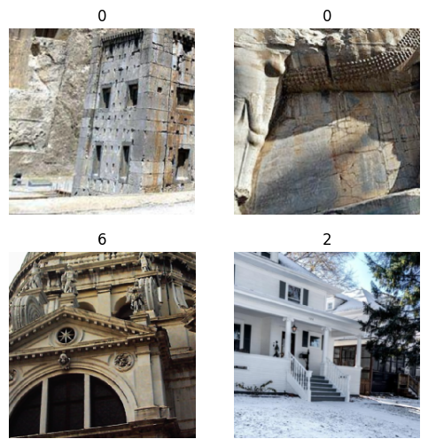
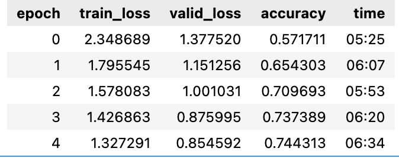

# Architectural Style Classification Based On Facade Images

This project reinforces the potential of CNNs in classifying classical, modern, and contemporary architectural styles. The commonly used nowadays state-of-art neural network ResNet is employed in research as a standalone model. The model was successfully trained to identify the architectural style of the building presented in the image.

## Dataset

For the basis of my dataset I took the original one made by [Marian Dumitru Danci](https://www.kaggle.com/datasets/dumitrux/architectural-styles-dataset) and [Zhe Xu](https://www.kaggle.com/wwymak/architecture-dataset). It is a mix between images scraped from Google Images by Marian Dumitru Danci and the dataset from the paper “Architectural Style Classification" by Zhe Xu. This dataset contained 10113 images from 25 architectural styles. Each image depicted a facade of the building, showcasing a distinct architectural style. In order to cover more architectural styles I followed Dumitru Danci’s strategy and developed the script which autonomously collected the appropriate images using Google Advanced Search.

<b>Architectural styles used to train the model</b>

-Achaemenid architecture
-American craftsman style
-American Foursquare architecture
-Ancient Egyptian architecture
-Art Deco architecture
-Art Nouveau architecture
-Baroque architecture
-Bauhaus architecture
-Beaux-Arts architecture
-Brutalism architecture
-Byzantine architecture
-Chicago school architecture
-Classical
-Colonial architecture
-Deconstructivism
-Edwardian architecture
-Georgian architecture
-Gothic architecture
-Greek Revival architecture
-International style
-Japanese
-Novelty architecture
-Palladian architecture
-Postmodern architecture
-Queen Anne architecture
-Romanesque architecture
-Russian Revival architecture
-Tudor Revival architecture

## Training

The model was trained with [fastai](https://www.fast.ai) library. 
For the training phase I applied data processing and augmentation for the prepared dataset. Images are resized to dimension 224x224 to optimize training process. Augmentations like random flips, rotations, and zooms are applied to diversify the dataset and enhance model robustness. I performed a random split of the dataset into training and validation sets, allocating 80% and 20% respectively. Image below presents 4 image samples of various architecture styles listed in the table before.

The model was trained with a total of 5 epochs, reaching 74% of accuracy by the end of the training.

## Testing on image examples

The model can be tested using style_predictor.py

## License

MIT License
